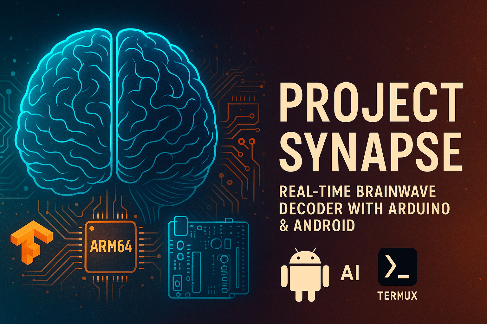
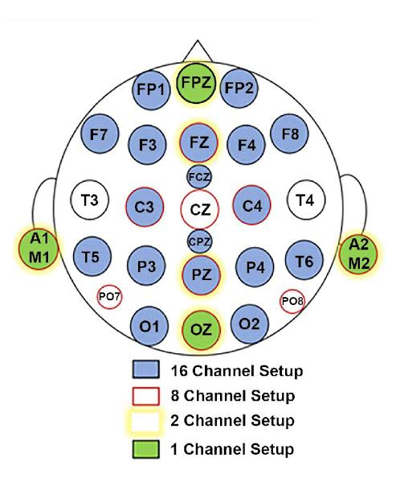
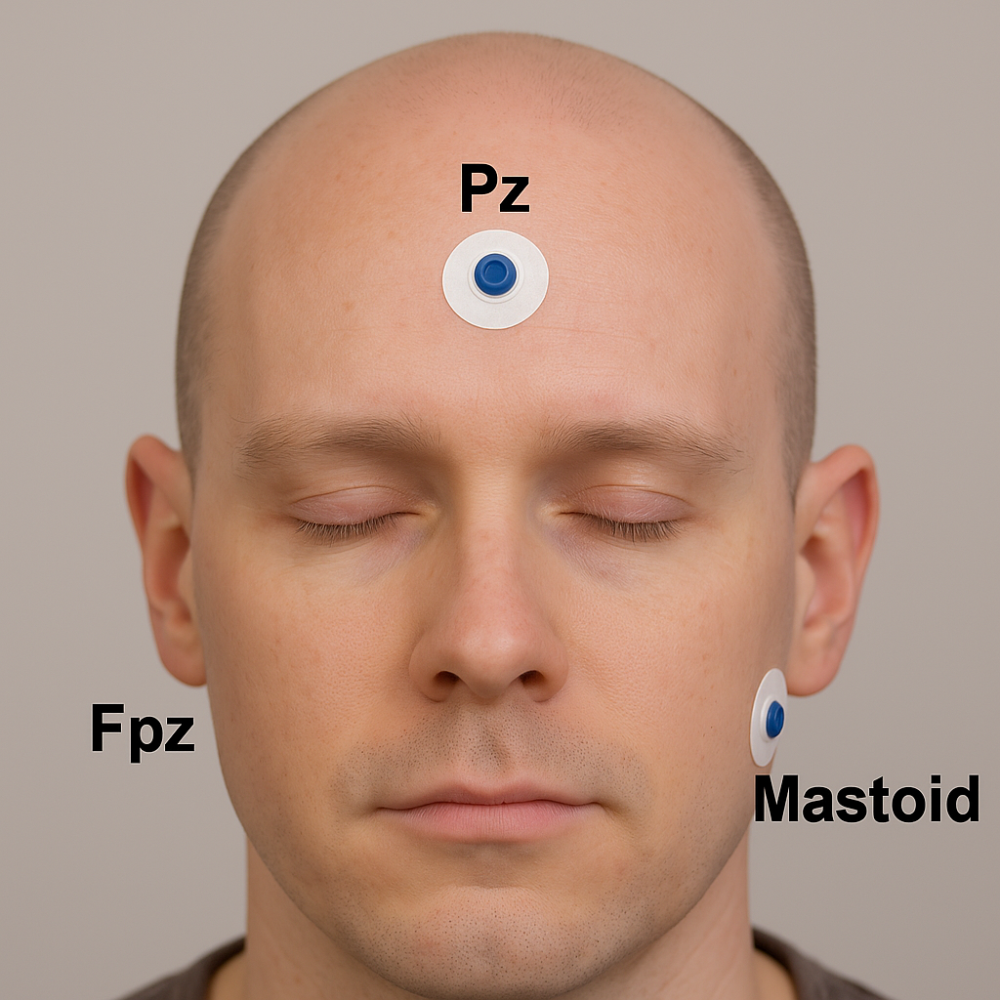

<p align="center">
  
</p>

> - Copyright © 2025 Yogesh R. Chauhan
> - Project Synapse – Brainwave Decoder
> - This project is licensed for personal and educational use only.
> - Commercial use, resale, or modification for profit is strictly prohibited.
> - Unauthorized use will result in legal action and takedown notices.


# Project Synapse: Real-Time Brainwave Decoder with Android
[](https://aur.archlinux.org/packages/mikey-7x-abd57)

Build a DIY EEG system to capture and decode your brain’s electrical activity into meaningful words in real-time — all using **own eeg circuit**,**Arduino**, **Android**, and **Arch Linux inside Termux**.

Quick Install via APT/yay (One-Line Command) and upload Arduino code in your Arduino uno that's it (do not need to see setup instructions if you use below one line automated command).

---

<div align="center">

<kbd>

⚡ `abd57e.sh` — The Next Evolution in Real-Time Signal Processing

✨ What’s New
| ⚙️ Feature | 🔍 Description |
|------------|----------------|
| ⚡ Performance Boost | Executes up to 2× faster |
| 🧩 Smarter Algorithms | Hybrid filtering for cleaner signals |
| 🎯 Precision Upgrade | Better adaptive calibration |
| 🪶 Easy Use | Single-command execution |

> ```bash
> wget https://raw.githubusercontent.com/mikey-7x/Project-Synapse-Real-Time-Brainwave-Decoder-with-Android/refs/heads/main/abd57e.py
> bash abd57e.sh
> ```

_“Project Synapse — Technology Beyond Boundaries.”_

</kbd>

</div>

---

[](https://mikey-7x.github.io/Project-Synapse-Real-Time-Brainwave-Decoder-with-Android/)

You can now install **Project Synapse** directly using `apt` like any official package!  
Works on **Debian, Ubuntu, Kali, Termux-Debian**, and other APT-based systems.

🔧 for debian,Ubuntu,kali etc(apt):
```
sudo apt update
sudo apt install mikey-7x-abd57
```
🔧for archlinux, manjaro etc(yay):
```
# 1. Install required packages
sudo pacman -S --needed git base-devel
# 2. Clone the yay AUR repository
git clone https://aur.archlinux.org/yay.git
# 3. Change into the yay directory
cd yay
# 4. Build and install yay
makepkg -si
yay -S --noconfirm mikey-7x-abd57
```
🚀run(both apt/yay):
```
mikey-7x-abd57
```

OR 
💦Universal shell script install:
```
wget https://raw.githubusercontent.com/mikey-7x/Project-Synapse-Real-Time-Brainwave-Decoder-with-Android/refs/heads/main/mikey.sh
mikey-7x-abd57
```

---

🔗 Direct download of .deb:

[](https://mikey-7x.github.io/Project-Synapse-Real-Time-Brainwave-Decoder-with-Android/mikey-7x-abd57_0.0.1-1_all.deb)

🌐 Hosted on GitHub Pages via gh-pages branch

📡 Global installation support without manual file download 

---

## 📸 Electrode Placement

Use **3 electrodes** based on the following 10-20 system positions:

- **Pz** → `T1` (center forehead)
- **Fpz** → `T3` (above nose, optional)
- **Mastoid** → `T2` (behind ear, ground/reference)



OR

place electrodes according to below image 

- **Pz** → `T1` (center forehead)
- **Fpz** → `T3` (behind the ear at right side of face)
- **Mastoid** → `T2` (as image front&below of ear)



i tried with this setup of electrodes and it's working perfectly 👍


## 🧰 Required Hardware

- Arduino Uno board  
- EEG Circuit (NE5534AP/TL081 based)  
- Electrodes (snap gel or dry)  
- Android phone (USB OTG supported)  
- USB OTG cable  


## 🪲 Circuit Diagram

The following hand-drawn schematic shows the EEG circuit + power supply:


## 🛠️ Step-by-Step Setup Guide

### 🔌 1. **Build the EEG Hardware**
Follow the circuit in the image above and connect:

- `T1 → Pz` (EEG active)
- `T2 → Mastoid` (Reference)
- `T3 → Fpz` (optional, can be left unconnected)

### 📱 2. **Install Termux & Packages on Android**
[📲 Download Termux (F-Droid)](https://f-droid.org/en/packages/com.termux/)

```bash
termux-setup-storage
pkg update && pkg upgrade -y
pkg install wget git curl termux-api -y
pkg install tur-repo x11-repo -y
pkg install termux-x11-nightly pulseaudio -y
```


### 🐧 3. Install Arch Linux via proot-distro
```
pkg install proot-distro -y
proot-distro install archlinux
proot-distro login archlinux
```

Inside Arch:
```
pacman -Syu python python-pip git base-devel wget --noconfirm
```


### 🧪 4. Setup Python Virtual Environment with Pyenv and install tensorflow 

Follow this repository for installing pyenv and tensorflow in Termux or Arch or use below commands.

[Tensorflow in Android](https://github.com/mikey-7x/Tensorflow-in-Android)

Create and activate the virtual environment:
```
pyenv install 3.10.13
pyenv virtualenv 3.10.13 tf-env
pyenv activate tf-env
```


### 📦 5. Install Python Dependencies
```
pip install --upgrade pip
pip install numpy==1.24.3 pandas scipy joblib scikit-learn tensorflow==2.13.1
```


### 🔌 6. Upload Arduino Sketch to Uno

Use the following code:
```
// EEG P300 Arduino v1.0 — sends raw samples at FS via Serial
#define EEG_PIN A0
#define FS 250
#define BUFFER_SIZE 128
volatile uint8_t buf[BUFFER_SIZE];
volatile int head = 0, tail = 0;
void setup() {
  Serial.begin(9600);
  noInterrupts();
  TCCR1A = 0; TCCR1B = 0; TCNT1 = 0;
  OCR1A = (16000000/(8*FS)) - 1;
  TCCR1B |= (1 << WGM12) | (1 << CS11);
  TIMSK1 |= (1 << OCIE1A);
  interrupts();
}
ISR(TIMER1_COMPA_vect) {
  int val = analogRead(EEG_PIN);
  uint8_t sample = val >> 2;
  buf[head] = sample | 0x80;
  head = (head + 1) % BUFFER_SIZE;
}
void loop() {
  while (tail != head) {
    Serial.write(buf[tail]);
    tail = (tail + 1) % BUFFER_SIZE;
  }
}
```


### 📲 7. Connect Android with Arduino (via OTG)

Install TCPUART APP from [tcpuart](https://play.google.com/store/apps/details?id=com.hardcodedjoy.tcpuart)

Set baud rate: 9600

Press Connect

Allow USB permission & select Server Mode

set Port: 8080

Press Start

To check Arduino's signal install:
```
wget https://raw.githubusercontent.com/mikey-7x/Project-Synapse-Real-Time-Brainwave-Decoder-with-Android/refs/heads/main/q3.py
```
Run:
```
python q3.py
```
if any numerical values shown that meas signal coming perfectly.now you can run actual abd57.py (advance brainwave decoder 57) script.👍


### ☣️ 8. Run EEG Decoder Software in archlinux in termux 

Clone this repo and activate virtualenv:
```
cd ~
git clone https://github.com/mikey-7x/Project-Synapse-Real-Time-Brainwave-Decoder-with-Android.git
cd Project-Synapse-Real-Time-Brainwave-Decoder-with-Android
pyenv activate tf-env
```

Run the script:
```
python abd57.py
```

You will see:

🧬 Quantum-Level EEG Decoder

[1] Record New Alphabet Samples

[2] Train from Existing Directory

[3] Predict in Real-Time

[4] Switch Model (Now: LSTM)

[5] Clear History

[6] Record Custom Word

[7] Discover Unique Patterns

[8] Exit


---

### 🎓 How to Use

Use [6] Record Custom Word → enter a word like yes or go

Think of it strongly during the recording session

Once training completes automatically, go to [3] Predict in Real-Time


> ⚠️ Note: Accuracy is best with 10–15 trained words only. More than that causes model confusion. Strong mental focus during training/predictions improves accuracy even above 20 trained words 🪽


---

### 📂 Files Included

File:Description

abd57.py:
EEG decoder, trainer & real-time predictor

abd.ino/abd.hex:
Arduino EEG sampling code

README.md:
This documentation


---

### 🛑 Disclaimer

This is not a medical device. It’s an experimental research tool for signal processing and brain-computer interface (BCI) exploration.


---

### 📜 License

This repository is released under a **custom license** for **educational and academic use only**.

- 🚫 Commercial use or resale of any part (code, circuit, models, diagrams) is strictly prohibited.
- ✅ Use in college/university research, projects, and learning is permitted.
- 📩 Contact the author for special permissions or collaboration.

See the full [LICENSE](./LICENSE) file for details.

© 2025 Yogesh R. Chauhan. All rights reserved.

---

### ☕Auther

Made with ❤️ by **[mikey-7x](https://github.com/mikey-7x)** For research & educational use only.🚀🔥  

[other repository](https://github.com/mikey-7x?tab=repositories)


