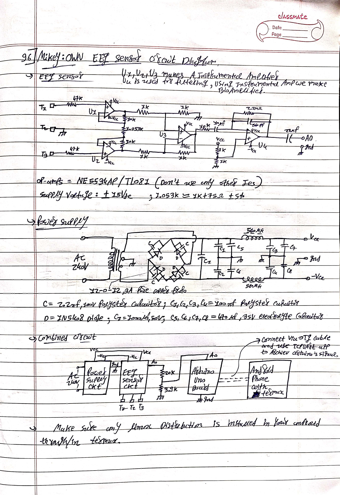

# Project Synapse: Real-Time Brainwave Decoder with Android

Build a DIY EEG system to capture and decode your brain’s electrical activity into meaningful words in real-time — all using **own eeg circuit**,**Arduino**, **Android**, and **Arch Linux inside Termux**.

---

## 📸 Electrode Placement

Use **3 electrodes** based on the following 10-20 system positions:

- **Pz** → `T1` (center forehead)
- **Fpz** → `T3` (above nose, optional)
- **Mastoid** → `T2` (behind ear, ground/reference)


OR

place electrodes according to below image 

- **Pz** → `T1` (center forehead)
- **Fpz** → `T3` (behind the ear at right side of face)
- **Mastoid** → `T2` (as image front&below of ear)


i tried with this setup of electrodes and it's working perfectly 👍

---

## 🧰 Required Hardware

- Arduino Uno board  
- EEG Circuit (NE5534AP/TL081 based)  
- Electrodes (snap gel or dry)  
- Android phone (USB OTG supported)  
- USB OTG cable  

---

## 🪲 Circuit Diagram

The following hand-drawn schematic shows the EEG circuit + power supply:



---

## 🛠️ Step-by-Step Setup Guide

### 🔌 1. **Build the EEG Hardware**
Follow the circuit in the image above and connect:

- `T1 → Pz` (EEG active)
- `T2 → Mastoid` (Reference)
- `T3 → Fpz` (optional, can be left unconnected)

### 📱 2. **Install Termux & Packages on Android**
[📲 Download Termux (F-Droid)](https://f-droid.org/en/packages/com.termux/)

```bash
termux-setup-storage
pkg update && pkg upgrade -y
pkg install wget git curl termux-api -y
pkg install tur-repo x11-repo -y
pkg install termux-x11-nightly pulseaudio -y
```

---

🐧 3. Install Arch Linux via proot-distro
```
pkg install proot-distro -y
proot-distro install archlinux
proot-distro login archlinux
```

Inside Arch:
```
pacman -Syu python python-pip git base-devel wget --noconfirm
```

---

🧪 4. Setup Python Virtual Environment with Pyenv and install tensorflow 

Follow this repository for installing pyenv and tensorflow in Termux or Arch or use below commands.

[Tensorflow in Android](https://github.com/mikey-7x/Tensorflow-in-Android)

Create and activate the virtual environment:
```
pyenv install 3.10.13
pyenv virtualenv 3.10.13 tf-env
pyenv activate tf-env
```

---

📦 5. Install Python Dependencies
```
pip install --upgrade pip
pip install numpy==1.24.3 pandas scipy joblib scikit-learn tensorflow==2.13.1
```

---

🔌 6. Upload Arduino Sketch to Uno

Use the following code:
```
// EEG P300 Arduino v1.0 — sends raw samples at FS via Serial
#define EEG_PIN A0
#define FS 250
#define BUFFER_SIZE 128
volatile uint8_t buf[BUFFER_SIZE];
volatile int head = 0, tail = 0;
void setup() {
  Serial.begin(9600);
  noInterrupts();
  TCCR1A = 0; TCCR1B = 0; TCNT1 = 0;
  OCR1A = (16000000/(8*FS)) - 1;
  TCCR1B |= (1 << WGM12) | (1 << CS11);
  TIMSK1 |= (1 << OCIE1A);
  interrupts();
}
ISR(TIMER1_COMPA_vect) {
  int val = analogRead(EEG_PIN);
  uint8_t sample = val >> 2;
  buf[head] = sample | 0x80;
  head = (head + 1) % BUFFER_SIZE;
}
void loop() {
  while (tail != head) {
    Serial.write(buf[tail]);
    tail = (tail + 1) % BUFFER_SIZE;
  }
}
```

---

📲 7. Connect Android with Arduino (via OTG)

Install TCPUART APP from [tcpuart](https://play.google.com/store/apps/details?id=com.hardcodedjoy.tcpuart)

Set baud rate: 9600

Press Connect

Allow USB permission & select Server Mode

set Port: 8080

Press Start


---

🧠 8. Run EEG Decoder Software in archlinux in termux 

Clone this repo and activate virtualenv:
```
cd ~
git clone https://github.com/your-username/eeg-p300
cd eeg-p300
pyenv activate tf-env
```

Run the script:
```
python abd57.py
```

You will see:

🧬 Quantum-Level EEG Decoder
[1] Record New Alphabet Samples
[2] Train from Existing Directory
[3] Predict in Real-Time
[4] Switch Model (Now: LSTM)
[5] Clear History
[6] Record Custom Word
[7] Discover Unique Patterns
[8] Exit


---

🎓 How to Use

Use [6] Record Custom Word → enter a word like yes or go

Think of it strongly during the recording session

Once training completes automatically, go to [3] Predict in Real-Time


> ⚠️ Note: Accuracy is best with 10–15 trained words only. More than that causes model confusion. Strong mental focus during training improves accuracy.


---

📂 Files Included

File	Description

abd57.py	EEG decoder, trainer & real-time predictor

eeg_p300.ino	Arduino EEG sampling code

README.md	This documentation


---

🧠 Author

Made with ♥ by Mikey-7x
For research & educational use only.


---

🛑 Disclaimer

This is not a medical device. It’s an experimental research tool for signal processing and brain-computer interface (BCI) exploration.

